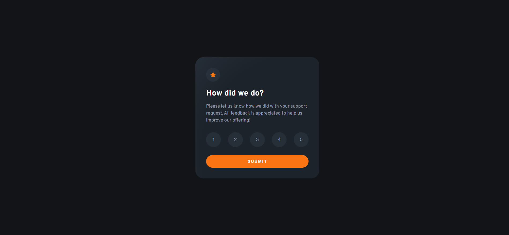

### Screenshot

### Links

- Live Site URL: [Add live site URL here](https://your-live-site-url.com)

## My process

### Built with

- Semantic HTML5 markup
- CSS custom properties
- Flexbox
- Desktop-first workflow

### What I learned

This project was really fun to build. i learned many techniques by soliving this challenge, the main thing that i learned is how to use radial graident and opactiy of colour to blend the main background colour with the element background colour to give reallt cool effect.

## Author

- github - [Ameer Khan](https://github.com/ameer005)
- Frontend Mentor - [@ameer005](https://www.frontendmentor.io/profile/ameer005)
